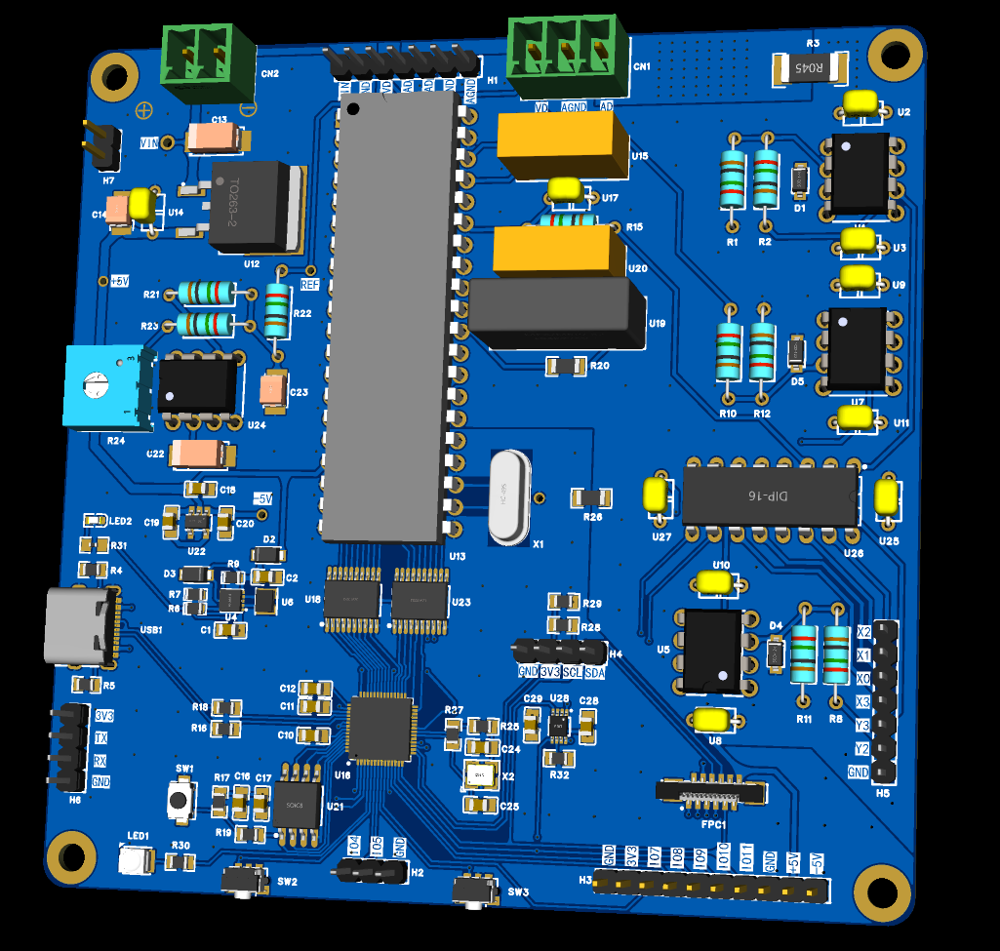
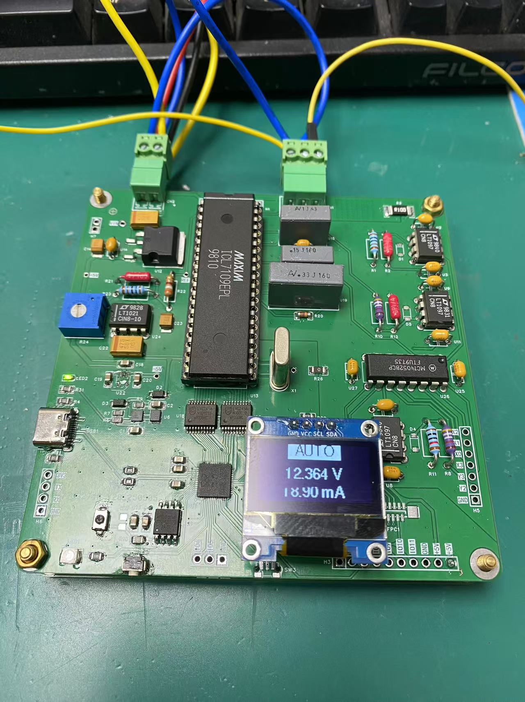

# 🔬 Precision Analog Measurement with ICL7109 on RP2040 + OLED

This is a MicroPython-based project that measures high-precision analog voltage and current using the **ICL7109 ADC**, controlled by an **RP2040-based board (Raspberry Pi Pico)**, and displays the result in real-time on a **128x64 OLED display**.

---

## 📸 Preview

> 
>  

---

## 🚀 Features

- 🎯 **High-resolution bipolar ADC reading** with ICL7109
- 🔀 **Auto & manual switching** between voltage/current and external channels via MC14052
- 📺 **OLED display with large font** using `writer.py` + `font10.py`
- 🔘 **Physical button control** to toggle between display modes
- 💡 **LED mode indicator** (ON = manual mode)
- 📐 **Voltage & current displayed simultaneously**
- 🧠 **Runs on RP2040-based board (Raspberry Pi Pico)**

---

## 🧰 Hardware Required

| Component            | Description                          |
|---------------------|--------------------------------------|
| 🎛 ICL7109           | ±0.01V 12-bit analog-to-digital converter |
| 🔘 MC14052           | Analog multiplexer (2:4)             |
| 📺 SSD1306 OLED      | 128x64 I2C screen (address `0x3D`)   |
| 🧠 RP2040 MCU        | Raspberry Pi Pico / Pico W (MicroPython) |
| 🔘 Tactile button    | Used for display mode toggle         |
| 💡 LED + resistor    | Indicates manual/auto mode           |
| 📐 Passive components| Pull-ups, dividers as needed         |

---

## 🧠 MCU Wiring (RP2040 GPIO)

| Function          | GPIO | Notes                          |
|-------------------|------|--------------------------------|
| SDA (OLED)        | 12   | I2C0 SDA                       |
| SCL (OLED)        | 13   | I2C0 SCL                       |
| ICL7109 STATUS    | 14   | Wait for data ready            |
| ICL7109 POL       | 15   | Sign bit (1=positive, 0=negative) |
| ICL7109 OR        | 16   | Over-range detection           |
| MC14052 A/B       | 10/11| Select Y0/Y1/Y2/Y3             |
| Button Input      | 3    | Low-active                     |
| Status LED        | 2    | Manual/auto indicator          |
| ICL7109 Data[0:11]| GPIO17 ~ GPIO28 | Reads ADC parallel output |

---

## 🖥️ OLED Display Layout

```text
+-------------------------------+
|        [  AUTO  ] (inverted) |
|                               |
|         +1.234 V              |
|         +56.78 mA             |
+-------------------------------+
